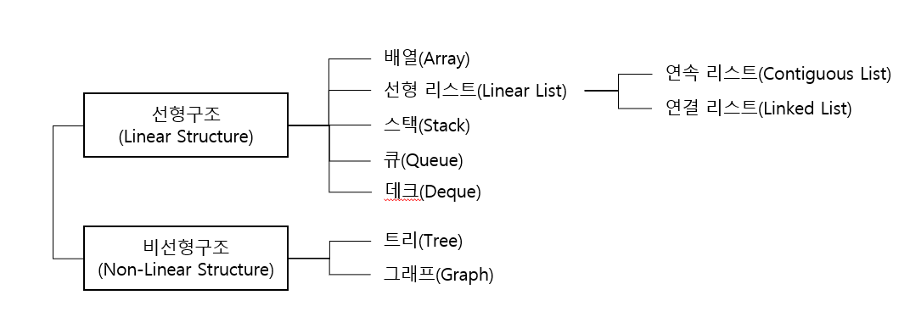

# What Is Array
### Content
- 자료구조
- 배열
    - 장점
    - 단점
- 자바에서의 사용

<br/>

## 자료구조
- 자료를 기억장치의 공간 내에 저장하는 방법과 자료 간의 관계, 처리 방법 등을 연구 분석하는 것
- 저장 공간의 효율성과 실행시간의 단축을 위해 사용
- 크게 선형 구조와 비선형 구조로 분류


<br/>

## 배열(Array)
- 크기와 형(Type)이 동일한 자료들이 순서대로 나열된 __자료의 집합__(자료형 x)
- 반복적인 데이터 처리 작업에 적합한 구조
- 정적인 자료구조로, 기억 장소의 추가가 어려움
- 데이터 삭제 시 기억장소가 빈 공간을 남아있어 메모리의 낭비가 심함
<br/>

### 장점
- 구현이 쉬움
- 검색 성능이 좋음(인덱스를 이용한 무작위 접근 가능)
- 순차 접근의 경우 배열은 데이터를 하나의 연속된 메모리 공간에 할당하므로 연결리스트보다 빠른 성능을 보여줌

<br/>

### 단점
- 자료의 삽입과 삭제에 비효율적(다음 항목의 모든 요소를 이동시켜야 함)
- 크기를 바꿀 수 없음
- 메모리의 재사용이 불가능(배열 요소를 삭제하더라도 메모리에서 제거되지 않는 이상 초기 에 할당 받은 메모리 공간을 계속 점유함)

<br/>

## 자바에서의 사용
- 배열의 길이를 먼저 설정하여 배열 변수를 먼저 생성한 다음 그 값을 나중에 대입하는 방법
- 배열의 값은 인덱스로 접근 가능
- 배열의 길이는 length로 구할 수 있음
- 빈번한 배열의 오류
    ```
    ArrayIndexOutOfBoundsException
    ```
    배열의 길이를 벗어난 값을 얻으려고 시도할 때 발생

<br/>


## 참고
- 시나공 정보처리기사 실기
- 점프 투 자바
- <https://codedragon.tistory.com/7468>

