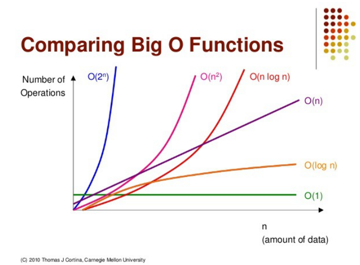

# What Is Big-O Notation
### Content
- Big-O 표기법
- 특징
- 성능비교
- 예제

 

## Big-O Notation
- 알고리즘의 효율성을 표기
- 보통 알고리즘의 시간복잡도와 공간복잡도를 나타낼 때 사용
- 알고리즘 효율성을 상한선 기준으로 표기
    - 높을 수록 최악의 경우
    - 이것보단 좋다는 것이 한 눈에 보임
- 수학적 정의   
    모든 n>=n0>0에 대하여 0<=f(n)<=k*g(n)인 양의 상수 k와 n0가 존재하면 f(n)=O(g(n))이다.

 

## 특징
- 상수항 무시   
- 영향력 없는 항 무시   

빅오 표기법은 데이터 입력값(n)이 충분히 크다고 가정

 

## 성능비교
   
O(1) < O(log n) < O(n) < O(n log n) < O(n^2) < O(2^n)      
낮음----------------------효율성---------------------높음   

 

## 예제
1. O(1): 스택에서 Push, Pop
2. O(log n): 이진트리
3. O(n): for문
4. O(n log n): 퀵정렬, 병합정렬, 힙정렬
5. O(n^2): 이중 for문, 삽입정렬, 거품정렬, 선택정렬
6. O(2^n): 피보나치 수열

 

## 참고
[빅오표기법(big-Onotation)이란](https://noahlogs.tistory.com/27)