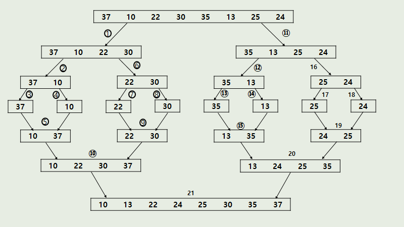

# What Is Sort(Merge, Quick, Heap)
### Content
- Merge Sort
- Quick Sort
- Heap Sort

<br/>

## Merge Sort(합병정렬)
- 입력이 2개의 부분 문제로 분할되고, 부분 문제의 크기가 1/2로 감소하는 분할 정복 알고리즘
- n개의 숫자들을 n/2개씩 2개의 부분문제로 분할하고 각각의 부분 문제를 순환적으로 합병 정렬한 후, 2개의 정렬된 부분을 합병하여 정렬(정복)

<br/>

### 수도 코드
```
MergeSort(A, p, q)
입력: A[p] ~ A[q]
출력: 정렬된 A[p] ~ A[q]
if(p < q) {
    k = (p + q) / 2
    MergeSort(A, p, k)
    MergeSort(A, k+1, q)
    A[p]~A[k] 와 A[k+1]~A[q]를 합병
}
```

<br/>

### 자바 코드
```
public class MergeSort {
    static int[] sorted;
    public static void main(String[] args) {
        int[] arr = {4, 3, 9, 2, 7, 1, 6, 5, 8};
        sorted = new int[arr.length];
        mergeSort(arr, 0, arr.length - 1);
        System.out.println(Arrays.toString(arr));
    }
    private static void mergeSort(int[] arr, int start, int end){
        if(start < end) {
            int mid = (start + end) / 2;
            mergeSort(arr, start, mid);
            mergeSort(arr, mid + 1, end);
            merge(arr, start, mid, end);
        }
    }
    private static void merge(int[] arr, int start, int mid, int end){
        int i, j, k, l;
        i = start; // 시작 임시 인덱스 값
        j = mid + 1; // 중간 임시 인덱스 값
        k = start; // 시작 임시 인덱스 값(임시 배열 index 의 역할)
        while(i <= mid && j <= end) { // 앞 배열과 뒷 배열 중 먼저 쫑나는 배열이 있을 떄 까지 반복
            if(arr[i] <= arr[j]) sorted[k++] = arr[i++];
            else sorted[k++] = arr[j++];
        }
        /*앞 배열이던 뒷 배열이던 먼저 쫑나지 않은 배열의 남은 값(정렬된 값)을 임시 배열에 넣는 작업*/
        if(i <= mid) 
            for(l = i; l <= mid; l++) 
                sorted[k++] = arr[l];
        else 
            for(l = j; l <= end; l++) 
                sorted[k++] = arr[l];
        /*if(i > mid) for(l = j; l <= end; l++) sorted[k++] = arr[l];
        else for(l = i; l <= mid; l++) sorted[k++] = arr[l];*/
        /*정렬된 임시 배열을 완성된 부분 배열로*/
        for(l = start; l <= end; l++) 
            arr[l] = sorted[l];
    }
}
```

<br/>

## Quick Sort(퀵 정렬)
- 하나의 리스트를 피벗(pivot)을 기준으로 두 개의 부분리스트로 나누어 하나는 피벗보다 작은 값들의 부분리스트, 다른 하나는 피벗보다 큰 값들의 부분리스트로 정렬
- 각 부분리스트에 대해 다시 재귀적으로 수행하여 정렬하는 방법
- 분할 정복 알고리즘 기반
- merge sort는 절반으로 나누지만 quick sort는 pivot 기분이므로 하나의 리스트에 대해 비균등하게 나뉜다는 차이가 있음
- 일반적으로 merge sort보다 quick sort가 빠름
- O(nlogn)의 시간 복잡도를 가짐

<br/>

### Quick Sort Process
1. 임의의 피벗 값(기준 값)을 설정한다.
2. 리스트의 길이를 n이라고 가정하자.   
리스트의 시작점 = 0(최초), 도착점 = n-1(최초)을 설정한다.   
시작점과 도착점에서 출발하며 피벗 값을 기준으로 피벗보다 작은 원소는 __왼쪽__으로, 큰 원소는 __오른쪽__으로 옮겨준다(swap).
3. 시작점>도착점이 되면 새로운 시작점과 도착점을 설정한다.   
파티션을 분할해 1~3 과정을 반복한다.
4. 시작점-도착점 사이의 리스트 원소가 한 개인 파티션은 더 이상 반복하지 않는다.

<br/>

### 자바 코드
```
public class Test {
    private static void quickSort(int[] arr) {
        quickSort(arr, 0, arr.length - 1);
    }
    private static void quickSort(int[] arr, int start, int end) {
        // 배열을 나눈 것의 오른쪽 파티션의 첫 번째 인덱스를 part2에 담음
        int part2 = partition(arr, start, end);
        // 오른쪽 파티션과 왼쪽 파티션의 사이에 원소가 한 개 이상이어야 왼쪽 파티션 진행
        if (start < part2 - 1) {
            quickSort(arr, start, part2 - 1);
        }
        // 오른쪽 파티션의 첫 번째가 마지막 인덱스보다 작을 때 오른쪽 파티션 진행
        if (part2 < end) {
            quickSort(arr, part2, end);
        }
    }
    private static int partition(int[] arr, int start, int end) {
        int pivot = arr[(start + end) / 2];
        while (start <= end) {
            while(arr[start] < pivot) start ++;
            while (arr[end] > pivot) end--;
            if (start <= end) {
                swap(arr, start, end);
                start++;
                end--;
            }
        }
        // 새로 나눌 오른쪽 파티션의 첫 번째 인덱스가 담김
        return start;
    }
    private static void swap(int[] arr, int start, int end) {
        int tmp = arr[start];
        arr[start] = arr[end];
        arr[end] = tmp;
    }
    private static void printArray(int[] arr) {
        for (int data : arr) {
            System.out.print(data+", ");
        }
        System.out.println();
    }
    public static void main(String[] args) {
        int[] arr = {3, 9, 4, 7, 5, 0, 1, 6, 8, 2};
        printArray(arr);
        quickSort(arr);
        printArray(arr);
    }
}
```

<br/>

## Heap Sort(힙 정렬)
- 힙 자료구조 기반
- 완전이진트리 기반의 트리형 자료구조로 최댓값이나 최솟값을 찾아내기 위해 사용됨
- 최대힙과 최소힙이 존재
    - 최대힙: 부모 노드의 키가 자식 노드의 키보다 같거나 큰 완전이진트리
    - 최소힙: 자식 노드의 키가 부모 노드의 키보다 같거나 큰 완전이진트리
- 정렬해야 할 n개의 데이터를 최대힙 또는 최소힙으로 구성
- 힙의 root 노드에서 값을 순서대로 추출한다.
    - root 노드의 값을 heap을 구성하는 마지막 노드와 교환한 뒤 힙의 크기를 1만큼 줄이는 방식
- 시간복잡도: O(nlogn)


<br/>

### 자바 코드
```
public class Test {
    public static void main(String[] args) {
        int[] arr= {1,5,3,2,9,6};
        System.out.println("before: " + Arrays.toString(arr));
        heapSort(arr);
        System.out.println("after: "+Arrays.toString(arr));
    }
    private static void heapSort(int[] arr) {
        int n = arr.length;
        // 최대힙 구성
        // n/2-1: 부모노드 인덱스 기준
        for (int i = n / 2 - 1; i >= 0; i--) {
            heapify(arr, n, i);
        }
        for (int i = n - 1; i > 0; i--) {
            swap(arr, 0, i);
            heapify(arr, i, 0);
        }
    }
    private static void heapify(int[] arr, int n, int i) {
        int p = i;
        int left = i * 2 + 1;
        int right = i * 2 + 2;
        // 왼쪽 자식노드
        if (left < n && arr[p] < arr[left]) {
            p = left;
        }
        // 오른쪽 자식노드
        if (right < n && arr[p] < arr[right]) {
            p = right;
        }
        // 부모노드 < 자식노드
        if (i != p) {
            swap(arr, p, i);
            heapify(arr, n, p);
        }
    }
    private static void swap(int[] arr, int p, int i) {
        int temp = arr[p];
        arr[p] = arr[i];
        arr[i] = temp;
    }
}
```

<br/>

## 참고
- [합병정렬 알고리즘 - 분할 정복 알고리즘](https://bblackscene21.tistory.com/m/8)
- [퀵정렬에 대해 알아보고 자바로 구현하기](https://www.youtube.com/watch?v=7BDzle2n47c&t=303s)
- [힙정렬](https://herong.tistory.com/entry/%ED%9E%99-%EC%A0%95%EB%A0%ACHeap-Sort)
