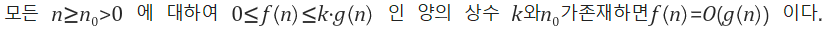
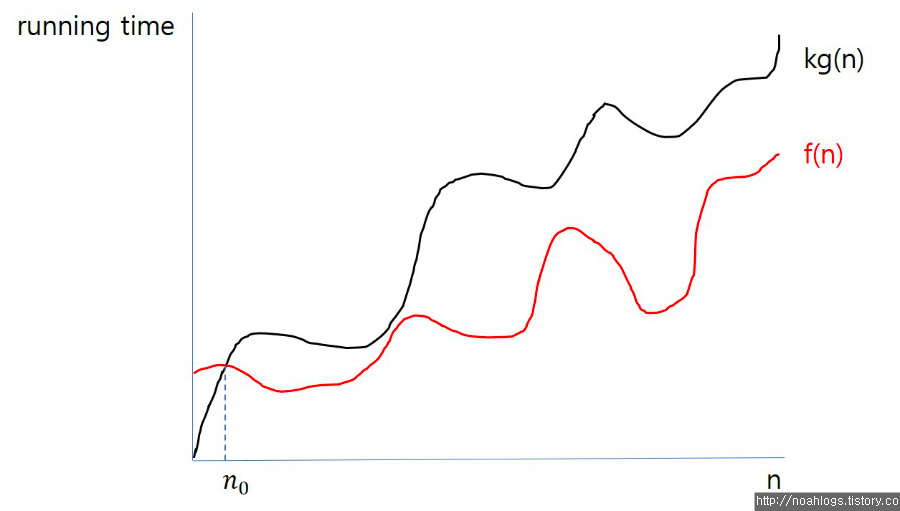
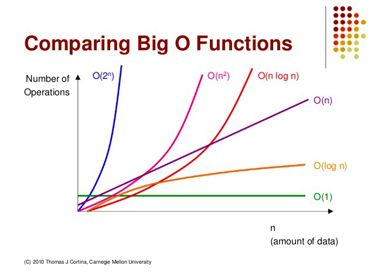

# Big O Notation

---

알고리즘 간의 효율성을 표기하기 위해 사용하는 표기법
알고리즘의 **시간 복잡도**와 **공간 복잡도**를 나타내는 데 사용됨

```
시간 복잡도는 알고리즘의 시간 효율성을 의미하고
공간 복잡도는 알고리즘의 공간(메모리) 효율성을 의미한다.
```

## 점근적 표기법
- 시간과 공간 복잡도를 나타내는 방법
- Big-O, Big-Ω, Big-Θ 표기법

### 왜 Big-O notation을 사용하는가?
- 알고리즘 효율성을 **상한선** 기준으로 표기하기 때문에
- Big-Ω는 하한선을 기준으로 하며 Big-Θ는 상한선과 하한선의 사이를 기준으로 표기함



- f(n) : 내가 만든 알고리즘의 시간 효율성을 보여주는 그래프
- n0보다 충분히 큰 입력값 n을 넣었을 때 내가 만든 알고리즘의 시간 효율성이 최악인 경우에도 점근 상한선인 k*g(n)을 넘을 수 없음
- 이때를 Big-O notation을 사용하여 **O(g(n))** 이라고 나타낸다.

### Big-O notation의 특징
1. 상수항 무시
   - 데이터 입력값이 충분히 크다고 가정하고 있기 때문에 상수항 같은 사소한 부분 무시
2. 영향력 없는 항 무시
   - 데이터 입력값의 크기에 따라 영향을 받기시때문에 가장 영향력이 큰 항 외의 항들 무시


- 오른쪽으로 갈 수록 성능 높음

### Big-O notation의 예제
1. O(1) : 스택에서 Push, Pop
2. O(log n) : 이진트리
3. O(n) : for 문
4. O(n log n) : 퀵 정렬(quick sort), 병합정렬(merge sort), 힙 정렬(heap Sort)
5. O(): 이중 for 문, 삽입정렬(insertion sort), 거품정렬(bubble sort), 선택정렬(selection sort)
6. O() : 피보나치 수열


참고: https://noahlogs.tistory.com/27 [인생의 로그캣:티스토리]